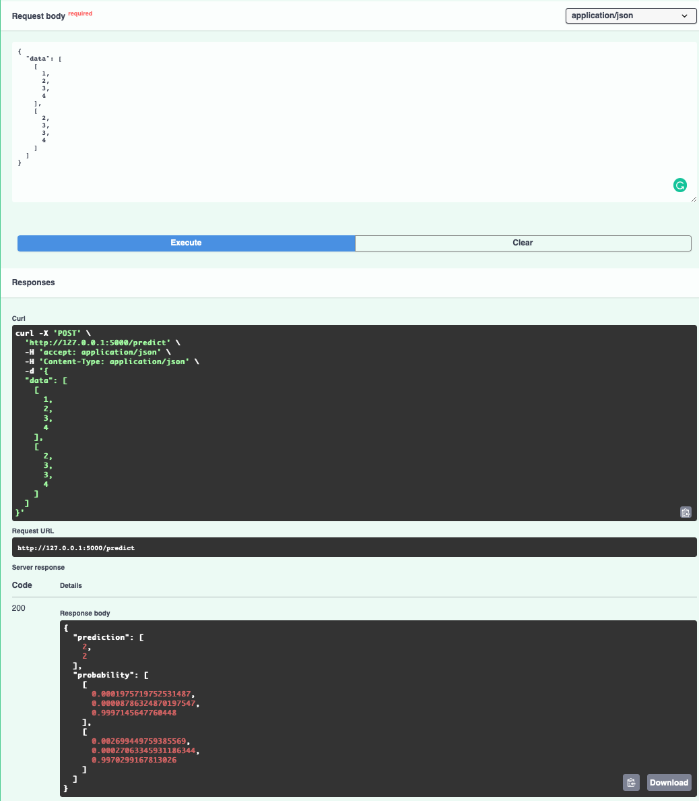

## Deployment: Fast API + Docker

### Source

- https://towardsdatascience.com/deploying-iris-classifications-with-fastapi-and-docker-7c9b83fdec3a

### Prerequisites

- Install Docker

### API

It’s short for Application Programming Interface. It’s simply an intermediary between two independent applications that communicate with each other.

If you’re a developer and want to make your application available for other developers to use and integrate with, you build an API that acts as an entry point to your app. 

The developers will therefore have to communicate with this API through HTTP requests such as GET, POST, PUT, DELETE to consume and interact with your service.

### FastAPI

FastAPI is the most popular go-to framework for building robust and high-performance APIs that scale in production environments.

FastAPI has gained a lot of popularity lately and saw a huge increase in user adoption among web developers but also data scientists and ML engineers.

- Simple and easy to use
- Does not come with a webserver; Serving the API is **uvicorn**’s responsibility which is a good choice given that uvicorn is a lightning-fast ASGI server implementation, using uvloop and httptools.
- FastAPI + uvicorn is one of the fastest
- Unlike Django or Flask, it supports asynchronous requests
- Does not come with a view component;  often used together with React/Vue/Angular/HTML for frontend
- Enforces variable typing, which encorces validation at runtime
- Allows data validation of parameters (e.g., maximum length)
- Supports error messages
- automatic doc generation by going to localhost/docs

In this example, we will only be using two HTTP methods:

- <code>GET</code>: used to retrieve data from the application
- <code>POST</code>: used to send data to the application (required for inference)

### Let's get started

#### 1. Create a new directory called `iris`. 

This directory will contain all the code used for building the application.

#### 2. Train a simple classifier

For simplicity, let’s use Logistic Regression as our algorithm. We can use sklearn to supply the Iris dataset and to do the modeling.
I structured the classifier as a class for readability. `train_model` is used to train the classifier and classify is used to classify new observations following this format:

`{'sepal_w': <sepal width>, 'sepal_l': <sepal length>, 'petal_w': <petal_width>, 'petal_l': <petal length>}`

Create a <code>model.py</code> in your <code>iris</code> directory.  Put this code below:

    import numpy as np
    from sklearn.datasets import load_iris
    from sklearn.linear_model import LogisticRegression

    class IrisClassifier:
        def __init__(self):
            self.X, self.y = load_iris(return_X_y=True)
            self.clf = self.train_model()
            self.iris_type = {
                0: 'setosa',
                1: 'versicolor',
                2: 'virginica'
            }

        def train_model(self) -> LogisticRegression:
            return LogisticRegression(solver='lbfgs',
                                    max_iter=1000,
                                    multi_class='multinomial').fit(self.X, self.y)

        def classify(self, features: dict):
            X = [features['sepal_l'], features['sepal_w'], features['petal_l'], features['petal_w']]
            prediction = self.clf.predict_proba([X])
            return {'class': self.iris_type[np.argmax(prediction)],
                    'probability': round(max(prediction[0]), 2)}

Note that this model is very simple...e.g., no scaling/splitting/gridsearch.  This is intended so we can quickly jump to deployment...

#### 3. Define the router

Inside the <code>iris</code>, create a directory <code>routers</code>.   Inside the directory, create <code>router.py</code>.  This routes <code>/classify</code> to its corresponding function. 

    # for serving endpoints
    from fastapi import APIRouter

    #for accepting JSON
    from starlette.responses import JSONResponse

    #import the class
    from iris.iris_classifier import IrisClassifier

    router = APIRouter()

    @router.post('/classify')
    def classify_iris(features: dict):
        clf = IrisClassifier()
        return JSONResponse(clf.classify(features))

#### 4. Define the app

Create `app.py` in the same level as `iris_classifier.py`.  In this script, we define the app and specify the router(s).

We also define a `healthcheck` function.  The function returns the operational status of the app based on the request status code.

    from fastapi import FastAPI
    from iris.router import iris_router

    app = FastAPI()
    app.include_router(iris_router.router, prefix='/iris')

    @app.get('/healthcheck', status_code=200)
    async def healthcheck():
        return 'Iris classifier working well.'

#### 5. Include Dependencies

Your current structure should look like this:

    iris
    +-- router
    |   +-- iris_router.py
    +-- app.py
    +-- iris_classifier.py

Go one directory up to create a `requirements.txt` file to specify all of the dependencies required to build this app.

My requirements.txt looks like this:

    fastapi==0.78.0
    numpy==1.19.4
    scikit_learn==0.24.2
    starlette==0.19.1
    uvicorn==0.18.2

#### 6. Dockerfile

We also need to create a Dockerfile which will contain the commands required to assemble the image. Once deployed, other applications will be able to consume from our iris classifier to make cool inferences about flowers.

    FROM python:3.8-slim-buster

    RUN apt-get update && apt-get install -y python3-dev build-essential

    RUN mkdir -p /usr/src/iris
    WORKDIR /usr/src/iris

    COPY requirements.txt .
    RUN pip3 install -r requirements.txt

    COPY . .

    EXPOSE 5000

    CMD ["uvicorn", "--host", "0.0.0.0", "--port", "5000", "iris.app:app"]

The first line defines the Docker base image for our application. The `python:3.8-slim-buster` is a popular image — it’s lightweight and very quick to build. 

Our Dockerfile concludes with a `CMD` which is used to set the default command to `uvicorn --host 0.0.0.0 --port 5000 iris.app:app`. The default command is executed when we run the container.

If you don't understand very well, don't worry!  There is many help online teaching you how to make Dockerfile. :-)

Now your file structure should be:

    iris
        +-- router
        |   +-- iris_router.py
        +-- app.py
        +-- iris_classifier.py
    requirements.txt
    Dockerfile

#### 7. Build and run the container

We are almost there!!

Build the docker image using 

    docker build . -t iris

This step takes a while to finish.

Check whether you have successfully build the image

    docker images

*Note: If you make any mistake, simply* `docker rmi [image_id]`*, and do the build again*.

After the image is built, generate the docker container using 

    docker run --name iris -p 8080:5000 iris

Check whether your image is running

    docker ps -a

*Note: If you want to stop, do* `docker stop [image_id]`*; if you want to remove the container, do* `docker rm [image_id]`*.  Do these until you are satisfied :-)*

This exposes the application to the port 8080. Running the container also kicks off the default command we set earlier — which effectively starts up the app!

#### 8. Use the API

So let's try our API.

First, I have to check my docker-machine ip by doing

    docker-machine ip default

Here, my ip is 192.168.99.100

First, let's try our healthcheck 

    curl 'http://192.168.99.100:8080/healthcheck'

To get an inference, use this request. The JSON string after -d is the model input passed to classify.

    curl 'http://192.168.99.100:8080/iris/classify' -X POST -H 'Content-Type: application/json' -d '{"sepal_l": 5, "sepal_w": 2, "petal_l": 3, "petal_w": 4}'

You will get:

    {"class":"versicolor","probability":0.57}

Don't worry.  Go to `localhost:8080/docs` to check out the Swagger UI. This makes testing requests so much easier.

You can also try with Postman, which is also easier.

In the next lab, let's create a simple **web interface**, and try deploy to **Heroku**.  Also setup **CI/CD with github actions**.

### Congrats!!
