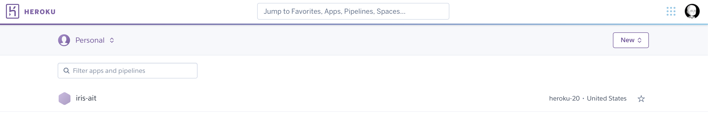

## Deployment: Heroku + Github Action

Let's deploy our app online.  We gonna use **Heroku** which is free but also support paid version.

### Install heroku cli 
(You can do it in any directory)

    brew tap heroku/brew && brew install heroku

If you are using other os, please refer to 

https://devcenter.heroku.com/articles/heroku-cli#install-the-heroku-cli

### Login 

Login to your heroku

(You can do it in any directory)

    heroku login
    heroku container:login

### Create heroku app

(You can do it in any directory; app name can be anything)

    heroku create [app-name]



### Push and deploy

Before we do anything, we have to revise the port variable in `Dockerfile`.  This is because heroku has its own port.

You can check the PORT variable via

    heroku run printenv -a [app-name]

For more details, read:  https://devcenter.heroku.com/articles/container-registry-and-runtime#dockerfile-commands-and-runtime

So revise your `Dockerfile` to:

```dockerfile
FROM python:3.8-slim-buster

RUN apt-get update && apt-get install -y python3-dev build-essential

WORKDIR /app

COPY requirements.txt .
RUN pip3 install -r requirements.txt

COPY . .

# EXPOSE 5000 <--we don't need this

CMD uvicorn --host 0.0.0.0 --port $PORT app:app
```

Now, let's push to heroku container register.  Go to your directory where the Dockerfile is:

    heroku container:push web -a [app-name]

(Note:  The first time I did this, it freezes.  Not sure why, but once I restarted my mac, it works fine.)

Then let's release to the public

    heroku container:release web -a [app-name]    

Now go to 

    http://[app-name].herokuapp.com/docs

If you want to change the domain name, just simply purchase a domain name and link with it.

(Note: if your app is not running, check the logs:  `heroku logs -a iris-ait`)

### Changing app

Now let's try add something in the `app.py` and see whether the changes propagate

```python
@app.get("/")
async def root():
    return {"message": "Hello World"}
```

Again, we just repeat the two steps:

    heroku container:push web -a [app-name]
    heroku container:release web -a [app-name]    

Go to 

    http://[app-name].herokuapp.com   

You will see the changes.

### Continuous integration with Github action

Now, this process can be automated, which is called **continuous integration** or **CI/CD**.  The idea is that whenever we push the code, it must run certain steps for us, such as test and deploy procedure for us.  There are two popular CI/CD frameworks which are **Jenkin** and **Github action**.  Since **Github action** has received a lot of interest lately, we shall explore it.


github action

https://github.com/marketplace/actions/deploy-to-heroku


    name: Deploy

    on:
    push:
        branches:
        - master

    jobs:
    build:
        runs-on: ubuntu-latest
        steps:
        - uses: actions/checkout@v2
        - uses: akhileshns/heroku-deploy@v3.12.12 #this is the action
            with:
            heroku_api_key: ${{secrets.HEROKU_API_KEY}}
            heroku_app_name: "YOUR APP's NAME" #Must be unique in Heroku
            heroku_email: "YOUR EMAIL"
            usedocker: true #<- Deploy with docker :-)
            appdir: "api" # <- This will point to the subdirectroy folder in your project


