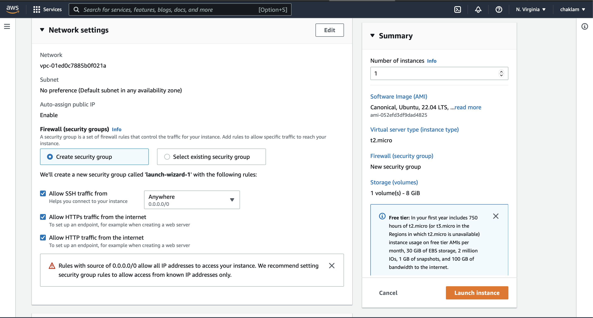
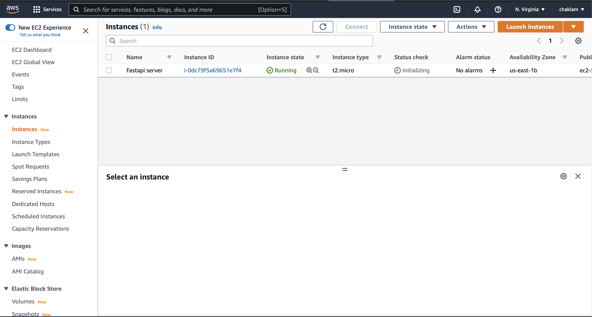

## Part 4: Deploy to AWS EC2

Bad news....Heroku does not really support Prometheus nor Grafana out of the box.   It can be done but requires way too much of effort.  Thus we gonna try something easier, i.e., AWS EC2.

First, sign up AWS services.  Here you would require a credit card.  If you don't have one, don't worry, you can just read the tutorial and do it later.

There are three ways to do this: (1) through **docker context** but this way it forces us to use Fargate which is not free, (2) through **ecs-cli** but it is quite restrictive on the versions that docker compose supports, and (3) through **ec2** which is as simple as spawning a server.   We will be going to the EC2 route.
<!-- 

### 1. Installing the ECS CLI

Basically, we just follow this:
https://docs.aws.amazon.com/AmazonECS/latest/developerguide/ECS_CLI_installation.html

For my mac, -->


### 1. Launch an instance
Go to EC2 service.  Select the orange button to create a instance.  An instance is basically a server.


### 2. Name and os

- **Name**: set any name
- **OS Images**:  choose Ubuntu
  


### 3. Instance type and key pair

- **Instance type**: Choose *t2.micro*; it's free for 1 year (but don't forget to turn this off, or you will be charged after a year!)
- **Key pair**: Create a new key-pair;  this will be used to ssh to the instance.   Any name is fine.


### 4. Network setting

Tick all ssh, http, and https so our instance can be accessed from all three ways.



### 5. Launch the instance

Once done, select Launch Instance (the orange button on the bottom right).


### 6. Check your instance

Go back to the home menu of instance, and you should see your instance initializing.  For now, please wait until it is ready.



### 7. Check the server address

Click on the instance ID (blue link) and will direct you to metadata of the server.   Try look around.  Take note of the server address. 


### 8. Add incoming ports

Scroll down and select the Security tab


Select the blue link on the Security groups.  You will be directed to tabs on inbound ruels:


Click Edit Inbound rules and add in two ports for prometheus and grafana, and save.  Note that we are not going to specify 8000, since we will be using port 80 for fastapi.


### 9. Connect to the instance

Let's connect to the instance.  To get some guidelines how to do so, click "Connect" on the top right corner. 

<br/><br/>

Select ssh client, which will tell us how to actually connect to this instance via ssh.  If you are using mac/linux, it's perfect.

<br/><br/>

Based on the instruction, let's open a terminal.  Copy the `fastapi_key.pem` to any place where you wanna ssh into (it does not really matter where; for mine is simply Desktop.)

At the same place where `fastapi_key.pem` resides, do

```shell
chmod 400 fastapi_key.pem
```

Connect to the instance (please use the address as your instance):

```shell
ssh -i "fastapi_key.pem" ubuntu@ec2-54-82-237-124.compute-1.amazonaws.com
```

Type "yes" (if this is your first time)

You will now be inside the ubuntu instance.  Yay!

<br/><br/>

### 10. Update and install stuffs

Let's treat this like a fresh ubuntu and start updating and installing the required stuffs.

```shell
#update our repository so we get access to all latest softwares
sudo apt-get update
```

Follow this https://www.digitalocean.com/community/tutorials/how-to-install-and-use-docker-on-ubuntu-22-04 and install the Docker and Docker Compose into the Ubuntu:

```shell
#install a few prerequisite packages which let apt use packages over HTTPS:
sudo apt -y install apt-transport-https ca-certificates curl software-properties-common

#adding the key to the official docker repo
curl -fsSL https://download.docker.com/linux/ubuntu/gpg | sudo gpg --dearmor -o /usr/share/keyrings/docker-archive-keyring.gpg

#add the repo to apt
echo "deb [arch=$(dpkg --print-architecture) signed-by=/usr/share/keyrings/docker-archive-keyring.gpg] https://download.docker.com/linux/ubuntu $(lsb_release -cs) stable" | sudo tee /etc/apt/sources.list.d/docker.list > /dev/null

#update again
sudo apt update

#Make sure you are about to install from the Docker repo instead of the default Ubuntu repo:
apt-cache policy docker-ce

#install docker
sudo apt install -y docker-ce docker-compose-plugin
```

### 11. Run your application

Clone your git repository:

```shell
git clone https://github.com/chaklam-silpasuwanchai/Deploy-ML-Production.git
```

Edit the `docker-compose.yaml` file and change the ports of Fastapi from 8000 to 80 like this:

<br/><br/>

Now run

```shell
sudo docker compose up
```

Recall your address of your AWS instance.  Go to that address, and you will see that everything is running (make sure you use http not https, as we are using port 80):

<br/><br/>

### Congrats!!  What's next?

Try reconfigure so that everytime we commit, it changes  for us :-).  

For your reference, look at the new `.github/workflows/main.yml` at `https://github.com/chaklam-silpasuwanchai/Deploy-ML-Production` for some hints how to do so.

Good luck!
